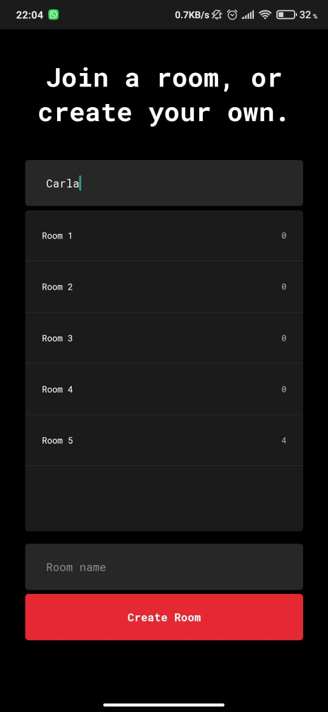
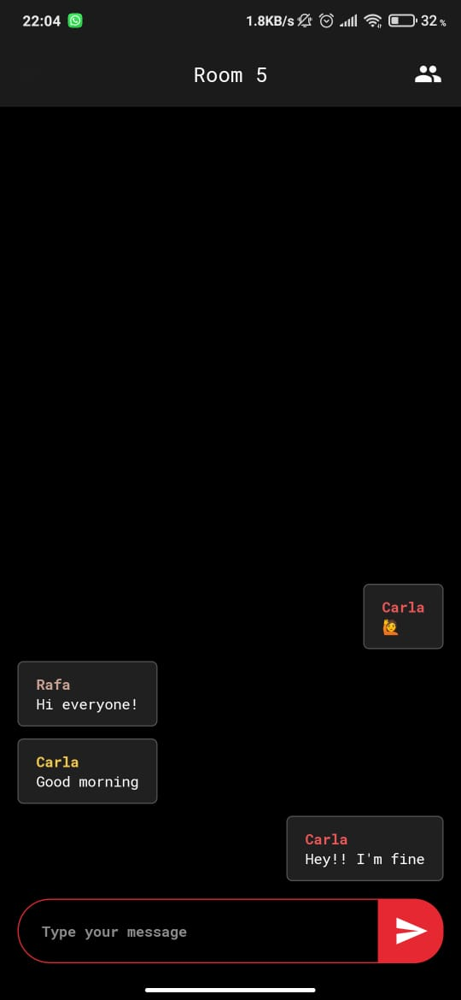
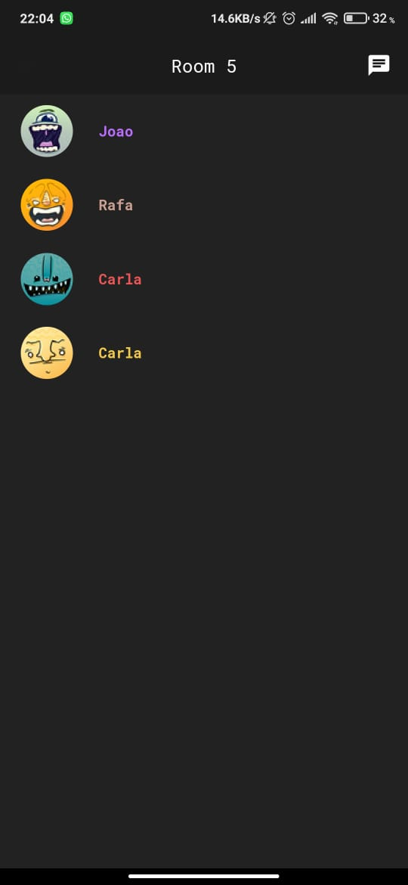

# Chatter/mobile

> Talk live to anyone from anywhere

<p align="start">
	  
	  
	  
	  
</p>

## Live

You can find and download the .apk here:
https://github.com/mpirescarvalho/chatter-mobile/releases/tag/v0.1

<br />

<p align="center">
  

  

  
</p>

## Contributing

1. Fork it (<https://github.com/mpirescarvalho/chatter-mobile/fork>)
2. Create your feature branch (`git checkout -b feature/awesome`)
3. Commit your changes (`git commit -am 'Add awesome feature'`)
4. Push to the branch (`git push origin feature/awesome`)
5. Create a new Pull Request

## Building

- You'll first need chatter-server running: https://github.com/mpirescarvalho/chatter-server

You'll need [Node.js](https://nodejs.org) installed on your computer in order to build this app.

```bash
$ git clone https://github.com/mpirescarvalho/chatter-mobile.git
$ cd chatter-mobile
$ npm install
$ npm run start
```

Runs the app in the development mode.<br/>

## Contact

<a href="https://github.com/mpirescarvalho">
  
</a>
<a href="mailto:mpirescarvalho17@gmail.com">
  
</a>
